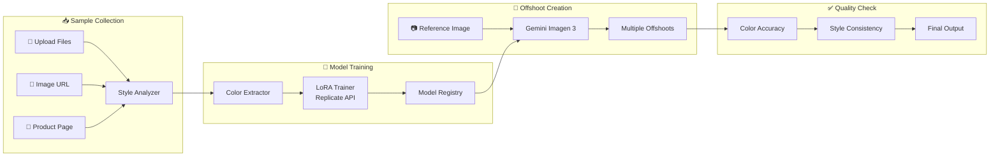

# Offshoot 🌱

Create styled image variations using custom-trained AI models. Upload samples, train your style, generate offshoots.

## ✨ Features

| Feature | Description |
|---------|-------------|
| **Custom Model Training** | Upload style samples → Train LoRA models via Replicate API |
| **Image Generation** | Generate variations with Google Gemini (Imagen 3) |
| **Product Page Scraping** | Paste Amazon/Shopify URLs → Extract product images |
| **Model Management** | Save, load, and switch between trained models |
| **Style Analysis** | Automatic color palette extraction and style profiling |
| **Unified Settings** | Manage API keys for Gemini + Replicate in one place |

## 🔑 API Keys Required

| Provider | Purpose | Get Key |
|----------|---------|---------|
| **Google Gemini** | Image generation | [Google AI Studio](https://aistudio.google.com/apikey) |
| **Replicate** | LoRA training (optional) | [Replicate](https://replicate.com/account/api-tokens) |

## 🏗️ Architecture



## 🚀 Quick Start

### Installation

```bash
git clone https://github.com/GitGudAK/offshoot.git
cd offshoot
npx serve
```

Open **http://localhost:3000**

### Configuration

1. Click ⚙️ **Settings**
2. Enter your **Gemini API key** (required for generation)
3. Enter your **Replicate API key** (optional, for training)
4. Save Settings

## 📖 Usage

### Upload Samples

Three ways to add images:

| Method | How |
|--------|-----|
| **Drag & Drop** | Drop files directly onto upload zone |
| **Image URL** | Paste direct image URL (`.jpg`, `.png`) |
| **Product Page** | Paste Amazon/Shopify URL → Select images from picker |

### Train Custom Model

| Parameter | What It Does | Default |
|-----------|--------------|---------|
| **Training Duration** | How long AI studies your images | 500 steps |
| **Style Memory** | How much detail to remember | 16 |
| **Learning Speed** | How aggressively AI learns | Normal |

Training takes 5-15 minutes via Replicate.

### Model Management

- **Save models** to browser storage
- **Switch between** multiple trained models
- **View model details** (training date, base model, etc.)
- Models persist across browser sessions

### Generate Offshoots

1. Upload a reference image
2. Select your trained model
3. Adjust variation strength
4. Choose number of outputs (1-8)
5. Click **Generate Offshoots**

## 📁 Project Structure

```
offshoot/
├── index.html              # Main HTML entry point
├── index.css               # Dark mode design system
├── app.js                  # Application orchestrator
└── modules/
    ├── asset-ingestion.js  # File upload & URL fetching
    ├── training-engine.js  # Replicate LoRA training
    ├── generation-agent.js # Gemini image generation
    ├── color-precision.js  # Style color extraction
    ├── model-registry.js   # Model persistence & management
    └── product-scraper.js  # E-commerce image extraction
```

## 🔌 API Integration

| Feature | Provider | Model | Cost |
|---------|----------|-------|------|
| Training | Replicate | `ostris/flux-dev-lora-trainer` | ~$0.10-0.50/job |
| Generation | Google | Imagen 3 (Gemini API) | ~$0.01-0.04/image |

## 🎨 Design

- **Dark mode** interface with purple/indigo accents
- **Glassmorphism** effects
- **Smooth animations** and micro-interactions
- **Responsive** layout

## 📈 Roadmap

- [x] Gemini API integration
- [x] Product page scraping
- [x] Unified settings UI
- [x] Simplified training parameters
- [ ] Batch generation mode
- [ ] Style comparison tools
- [ ] Export to Figma/Adobe

## 🤝 Contributing

Contributions welcome! Please submit a Pull Request.

## 📄 License

MIT License
