# Offshoot 🌱

Create styled image variations using custom-trained AI models. Upload samples, train your style, generate offshoots.


## ✨ Features

| Feature | Description |
|---------|-------------|
| **Custom Model Training** | Upload style samples → Train LoRA models via Replicate API |
| **Image Variations** | Input reference image → Generate multiple styled offshoots |
| **Style Analysis** | Automatic color palette extraction and style profiling |
| **Quality Reports** | Color accuracy and style consistency validation |

## 🏗️ Architecture

```mermaid
flowchart LR
    subgraph Input["📥 Sample Collection"]
        A[📁 Upload Samples] --> B[Style Analyzer]
        A2[🔗 URL Import] --> B
    end
    
    subgraph Training["🧠 Model Training"]
        B --> C[Color Extractor]
        C --> D[LoRA Trainer<br/>Replicate API]
        D --> E[Model Registry]
    end
    
    subgraph Generation["🌱 Offshoot Creation"]
        F[📷 Reference Image] --> G[Generation Engine]
        E --> G
        G --> H[Multiple Offshoots]
    end
    
    subgraph Validation["✅ Quality Check"]
        H --> I[Color Accuracy]
        I --> J[Style Consistency]
        J --> K[Final Output]
    end
```



## 🚀 Quick Start

### Prerequisites

- A [Replicate](https://replicate.com) account and API key
- Modern web browser

### Installation

1. **Clone the repository**
   ```bash
   git clone https://github.com/YOUR_USERNAME/offshoot.git
   cd offshoot
   ```

2. **Serve the application**
   ```bash
   npx serve
   ```

3. **Open in browser**
   ```
   http://localhost:3000
   ```

4. **Configure API Key**
   - Click the ⚙️ settings icon
   - Enter your Replicate API key
   - Click Save Settings

## 📖 Usage

### 1. Upload Style Samples

- Drag and drop 5-20 images that represent your target style
- Or paste direct image URLs to import
- The system will automatically extract color palettes and style characteristics

### 2. Train Custom Model

| Parameter | Description | Recommended |
|-----------|-------------|-------------|
| Model Name | Unique identifier | `my-style-v1` |
| Base Model | Foundation model | Flux Dev |
| Training Steps | Iterations | 500-1000 |
| LoRA Rank | Model capacity | 16 |

Training typically takes 5-15 minutes.

### 3. Generate Offshoots

1. Upload a reference image
2. Select your trained model
3. Adjust variation strength (50% is balanced)
4. Choose number of offshoots (1-8)
5. Click **Generate Offshoots**

## 📁 Project Structure

```
offshoot/
├── index.html              # Main HTML entry point
├── index.css               # Dark mode design system
├── app.js                  # Application orchestrator
└── modules/
    ├── asset-ingestion.js  # File upload & URL fetching
    ├── training-engine.js  # Replicate LoRA training
    ├── generation-agent.js # Image-to-image generation
    ├── color-precision.js  # Style color extraction
    └── model-registry.js   # Model persistence
```

## 🔌 API Integration

| Feature | Replicate Model | Cost |
|---------|-----------------|------|
| LoRA Training | `ostris/flux-dev-lora-trainer` | ~$0.10-0.50/job |
| Image Generation | Custom trained model | ~$0.01/image |

## 🎨 Design

- **Dark mode** interface with purple/indigo accents
- **Glassmorphism** effects
- **Smooth animations**
- **Responsive** layout

## 📈 Roadmap

- [ ] Webhook-based training status
- [ ] Batch generation mode
- [ ] Style comparison tools
- [ ] Team collaboration
- [ ] Figma/Adobe integration

## 🤝 Contributing

Contributions welcome! Please submit a Pull Request.

## 📄 License

MIT License - see [LICENSE](LICENSE) for details.
