# Brand AI Content Engine 🎨

An enterprise-grade generative AI content engine for creating brand-consistent image variations using custom-trained LoRA models.


## ✨ Features

| Component | Description |
|-----------|-------------|
| **Custom Model Training** | Upload brand assets → Train LoRA models via Replicate API |
| **Image-to-Image Variations** | Input reference image → Generate multiple styled variations |
| **Technical Precision** | Automatic color palette extraction and validation |
| **Brand Governance** | Style consistency checking and enforcement |

## 🏗️ Architecture

```mermaid
flowchart LR
    subgraph Input["📥 Asset Ingestion"]
        A[📁 Upload Assets] --> B[Asset Processor]
        A2[🔗 URL Import] --> B
    end
    
    subgraph Training["🧠 Custom Model Training"]
        B --> C[Color Extractor]
        C --> D[LoRA Trainer<br/>Replicate API]
        D --> E[Model Registry]
    end
    
    subgraph Generation["🎨 Agentic Workflows"]
        F[📷 Reference Image] --> G[Generation Agent]
        E --> G
        G --> H[Multiple Variations]
    end
    
    subgraph Validation["✅ Technical Precision"]
        H --> I[Color Precision Check]
        I --> J[Style Consistency]
        J --> K[Final Output]
    end
```



## 🚀 Quick Start

### Prerequisites

- A [Replicate](https://replicate.com) account and API key
- Modern web browser (Chrome, Firefox, Safari, Edge)

### Installation

1. **Clone the repository**
   ```bash
   git clone https://github.com/YOUR_USERNAME/brand-ai-engine.git
   cd brand-ai-engine
   ```

2. **Serve the application**
   ```bash
   # Using npx
   npx serve
   
   # Or using Python
   python -m http.server 3000
   
   # Or using any static file server
   ```

3. **Open in browser**
   ```
   http://localhost:3000
   ```

4. **Configure API Key**
   - Click the ⚙️ settings icon
   - Enter your Replicate API key
   - Click Save Settings

## 📖 Usage

### 1. Upload Brand Assets

- Drag and drop 5-20 images that represent your brand's visual style
- Or paste direct image URLs to import
- The system will automatically extract your brand's color palette

### 2. Train Custom Model

Configure your LoRA training:

| Parameter | Description | Recommended |
|-----------|-------------|-------------|
| Model Name | Unique identifier | `my-brand-v1` |
| Base Model | Foundation model | Flux Dev |
| Training Steps | Iterations | 500-1000 |
| LoRA Rank | Model capacity | 16 |

Training typically takes 5-15 minutes.

### 3. Generate Variations

1. Upload a reference image
2. Select your trained model
3. Adjust variation strength (50% is balanced)
4. Choose number of outputs (1-8)
5. Click **Generate Variations**

## 📁 Project Structure

```
brand-ai-engine/
├── index.html              # Main HTML entry point
├── index.css               # Premium dark mode design system
├── app.js                  # Application orchestrator
└── modules/
    ├── asset-ingestion.js  # File upload & URL fetching
    ├── training-engine.js  # Replicate LoRA training
    ├── generation-agent.js # Image-to-image generation
    ├── color-precision.js  # Brand color extraction
    └── model-registry.js   # Model persistence
```

## 🔌 API Integration

This project uses the [Replicate API](https://replicate.com/docs) for:

| Feature | Model | Approximate Cost |
|---------|-------|------------------|
| LoRA Training | `ostris/flux-dev-lora-trainer` | $0.10-0.50/job |
| Image Generation | Custom trained model | ~$0.01/image |

## 🎨 Design System

The UI features a premium dark mode interface with:

- **Glassmorphism** effects for depth
- **Purple/indigo** accent gradient
- **Smooth animations** for polish
- **Responsive** design for all screen sizes

## 🛠️ Tech Stack

- **Frontend**: Vanilla HTML, CSS, JavaScript (ES Modules)
- **AI Training**: Replicate API (Flux LoRA Trainer)
- **Image Generation**: Replicate API (Custom LoRA models)
- **Storage**: Browser LocalStorage for persistence
- **Dependencies**: JSZip (loaded dynamically for exports)

## 📈 Roadmap

- [ ] Backend server for webhook-based training status
- [ ] Logo detection with ML model
- [ ] A/B testing for generated variations
- [ ] Figma/Adobe Express integration
- [ ] Batch generation mode
- [ ] Team collaboration features

## 🤝 Contributing

Contributions are welcome! Please feel free to submit a Pull Request.

## 📄 License

MIT License - see [LICENSE](LICENSE) for details.

## 🙏 Acknowledgments

- [Replicate](https://replicate.com) for the AI infrastructure
- [Ostris](https://github.com/ostris) for the Flux LoRA trainer
- Inspired by enterprise brand governance best practices
